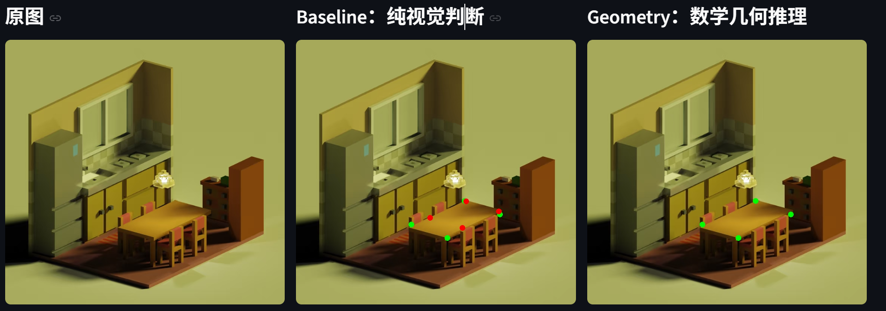
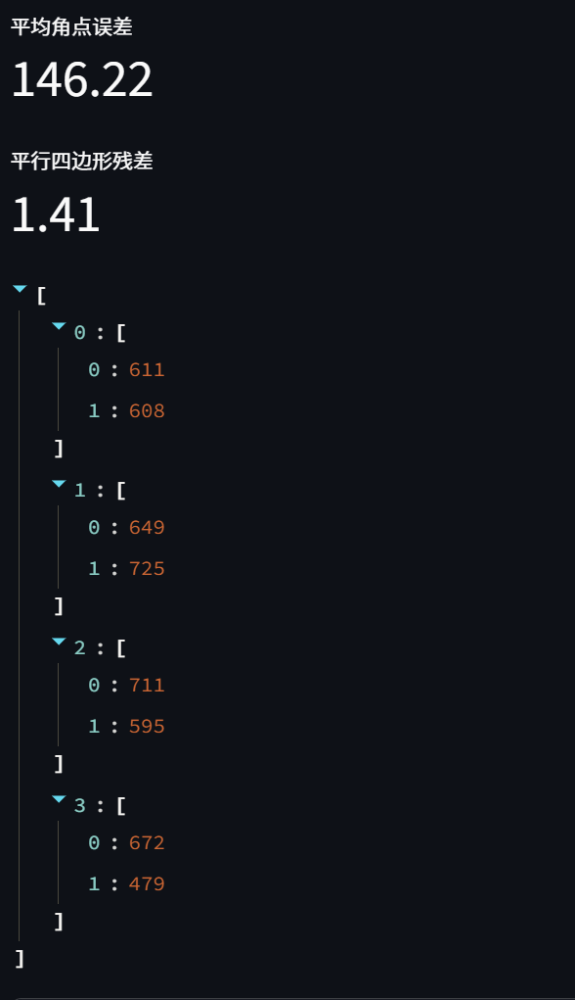

# Agent Vision：数学几何与像素指向（Math-Pointing）结合 

核心*Insight*是证明**数学推理能力能够辅助视觉识别采样定位**

听从师兄建议，将谈话内容听过一遍后总结出四个要点。
问题 A：具体的数学几何推理 + Pointing 的**重点 Case （应用场景）**列举（需求）
问题 B：如何利用 3D 数据集图片自动生成高质量 GT（逻辑应该是通过 3D 模型渲染 2D 图像，直接获取绝对精确的像素坐标作为真值）
问题 C：如何构建小规模但有说服力、可行性的 Benchmark（重点是数据集的构建，需调研数据集构建思路）
问题 D：如何从“工程代码”转向“Agent 模式”（优先度暂时不高，可以后续再考虑）

---
问题 A：具体的数学几何推理 + Pointing 的重点 Case
首先我从之前做的*桌角识别*入手分析了这个应用体现出的数学几何推理+Pointing 的特点。
1. 遮挡补全（Occlusion Completion）：
· 场景描述：正交照片中一个长方形桌子，其中一个角被桌上的书本彻底遮挡 。
· 数学逻辑：利用平行四边形的对边平行且相等的几何属性。
· Agent 行为：识别出可见的三个角坐标 $(x_1, y_1), (x_2, y_2), (x_3, y_3)$，通过解析几何公式$\vec{P_4} = \vec{P_1} + (\vec{P_3} - \vec{P_2})$计算出被遮挡的第四个点的精确像素坐标 。

其中若没有数学几何推理，模型在遮挡区依靠像素预测，容易受到遮挡物边缘的干扰 。

我由此根据一些规则图形的几何性质，列举了一些可能的 Case：（仍基于正交图片）
2. 四边形几何中心定位：引导 Agent 提取四个顶点并求解两条对角线方程 $y = kx + b$ 的交点 。
3. 等间距线性序列的外推：Prompt 要求 Agent 检测前两个点位，生成等差数列计算代码。
4. 复合几何体的物理重心采样：Agent 识别各子部件面积与形心，执行重心加权计算脚本。
5. 预判性切点采样：在物体尚未接触时预测其逻辑接触点，提示 Agent 拟合直线方程并求解圆心投影点坐标。
6. 面积等分逻辑采样：视觉模型只能粗略估计中线；数学 Agent 通过多边形面积计算公式进行精确分割。

这里我觉得有必要验证数学几何推理的有效性。为了验证数学几何推理的有效性，我进行了对比实验。为举例，我尝试在*桌角识别*任务中单独增加无提示词版本的识别模式，与已经基本完备的提示词模式进行对比识别，发现含有数学几何推理的提示词显著提升了模型在遮挡区域的表现。

**示意图（3D 场景中的有遮挡的桌面顶点 / Pointing 标注）：**

为此我还初步专门搭建了一个对比实验平台，还可以提供误差值。

---
问题 B：如何利用 3D 数据集图片自动生成高质量 GT
只是初步查阅了几篇文章还没有形成体系和有效思路，下周进行。

---
问题 C：如何构建小规模但有说服力、可行性的 Benchmark
除了之前搜集到的数据集，由于数量过于庞大并且内容非常杂乱，于是我想到能否由ai根据提示词自动生成自己想要的数据集。于是我建立了一个基于gemini-2.5-flash-image的图片生成平台，尝试初步形成一个小型数据集，不过数量较少并且效率较低，决定接着尝试在网上相关热门大数据集中筛选。但是最重要的benchmark的制定构建还未有思路，下周进行。
