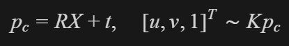
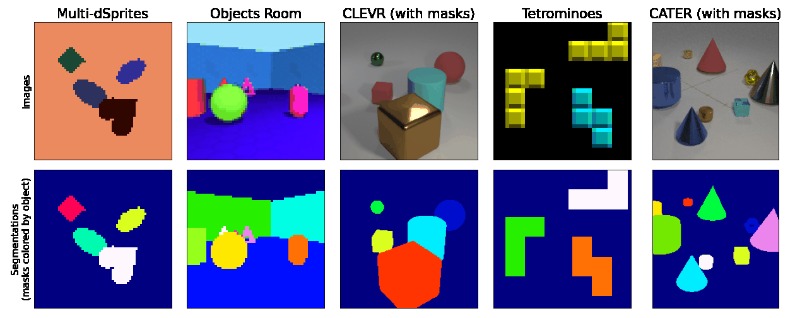

# 问题 B 初步调研思路

## 0. 目标与原则
问题 B 的核心目标是：**构建高质量 GT（像素级真值）的方法论与落地路径**。  
我先定下了调研顺序以便于理清思路：先理论、再实践、后构建，不急着做重 pipeline。

---
## 1. 第一阶段：先调研 GT 计算方法（理论层）
### 1.1 阶段目标
先回答“别人是怎么得到 Pointing / 空间推理 GT 的”，形成方法地图。

### 1.2 重点调研内容
我从师兄的指导以及初步调研中总结出了以下5个 GT 计算方法，下面按照方法分别阐述具体调研成果。
- 自动标注：3D 场景参数化渲染后直接导出 GT。  
    1）我率先调研了Pixel Reasoner（https://arxiv.org/abs/2505.15966）这篇文章，是因为觉得其引入像素空间推理的概念与我们研究方向很契合，但是阅读过后发现其并没有专注于三维图片的GT计算方法，也没有说明数据集的选取依据，但是其中给VLM配备的一系列视觉推理操作（比如放大/选择帧）运用的方法我觉得是有可取之处的。这里按照方法分类来进行简要说明。
    · 文章中重点讨论的是半自动标注和规则生成两种方法，涉及自动标注的视觉推理操作仅有用 GPT-4o 自动生成“全图分析 + 局部分析 + 答案”的文本段，自动插入所用算法中的视觉操作（zoom-in：定位到图片的关键区域 / select-frame：在视频中，抽取到关键帧）来自动合成训练轨迹。
    · 所使用的数据集：SA1B（高清自然图像数据，包含很多细节）、Fineweb（网页截图，包含问题和答案，以及对应的bounding box标注）和STARQA（视频数据，包含问答对）。

    2）BlenderProc（https://github.com/DLR-RM/BlenderProc）：一种用于照片级真实渲染的程序化 Blender 流程，核心机制是在 Blender 渲染时同步输出多种渲染通道 + 场景几何信息，而不是“渲染完再猜标签”。
    该自动标注流程通常是：
        1.加载3D对象与场景：
        导入 CAD/mesh，给每个物体唯一 ID（如 category_id）、类别标签，以便于渲染器在像素级命中时可直接回填。即
            GT(u,v)=f(scene params,camera,visibility)
        是确定性函数，不需要人工框选。
        2.随机化场景：
        先用脚本定义场景参数，包含随机相机位姿、物体姿态、光照、材质、遮挡关系。
        3.渲染多通道：
        渲染时（光线追踪/栅格化本质类似），每个像素都会得到“命中记录”，命中的物体是谁（instance/category）、命中点深度是多少（z/距离）、RGB、深度、法线、语义分割、实例分割等一起出，所以GT是渲染管线内生结果。
        4.自动生成结构化标签：
        ·2D bbox（由实例mask外接矩形计算）
        ·6D pose（物体在世界/相机坐标系位姿）
        ·相机内外参（投影矩阵）
        ·可见率/遮挡率（由mask面积比等计算）等
        除 seg/depth 外，还可用相机内外参把 3D 点投影成 2D GT：
        
        再结合深度图做可见性判断（遮挡过滤），得到高质量 Pointing GT。

    通过使用BlenderProc，可直接拿到简单几何体在3D中的坐标，然后用相机参数投影到2D得到像素真值GT，然后进一步结合几何性质进行研究，比如可以同时拿到遮挡比例做 meta 分层。输入源是3D/CAD/真实图像，GT 计算逻辑是3D点 -> 相机内外参 -> 2D像素 投影生成 Pointing GT。精度上限高在仿真域内可接近“几何真值”，误差来源主要是相机朝向配置、投影坐标系细节、遮挡可见性阈值、采样分布不均、仿真到真实域差距等。

    我当前已经成功尝试使用blenderproc，已经形成了从原理到可运行管线的完整闭环，实现了可视化流程建立、JSON GT 自动导出实现和批量数据集生成，并且成功尝试引入多几何体、遮挡体、随机视角等复杂几何情形。 
    json示例：
    顶层标签：`sample_id`、`image_file`、`gt_file`、`image_size_wh`、`cam2world`、`k_matrix`、`num_instances`、`instances`、`projected_targets`、`num_projected_targets`；`instances` 子标签：`target_id`、`shape_type`、`centroid_uv`、`bbox_xyxy`、`in_image`、`visible_by_depth`；`projected_targets` 子标签：`target_id`、`shape_type`、`center_3d_world`、`center_2d_uv`、`in_image`、`visible_by_depth`、`depth_at_projected_pixel`、`projected_bbox_xyxy`。

- 半自动标注：模型预标 + 人工校正。  
    1）Pixel Reasoner重点讨论了该方法来生成数据。数据生成过程：分析图片—>执行图片视觉操作—>分析操作后的图片—>最终答案。前两步就是简易的自动标注模型预标过程，后两步加入人工校正和回灌训练，通过插入错误的步骤，让模型学会纠错过程，最终得到可直接用于 SFT 的监督样本。
    · 得到SFT数据后便进行SFT+RL的联合训练VLM

    2）CVAT（https://docs.cvat.ai/docs/annotation/auto-annotation/automatic-annotation/）：是一个开源的数据标注平台，具有半自动模型预标注（auto annotation）、交互式分割（如 SAM 集成）、跟踪辅助等能力，并且可以处理多类型任务（比如框、分割、多边形、关键点、轨迹、属性标签等）。
    CVAT主要是先由检测/分割模型生成框、mask、关键点、轨迹等“初标”进行预标注，然后再由人工交互在 Web UI 修正（类别错、边界偏、漏标、ID跳变等错误），然后将被修正最多的样本回灌模型再训练，导出标准格式（COCO、YOLO、CVAT XML 等）。如此往复会使下一轮预标更准，人工工作量继续下降。

    暂时没有进行实践尝试。
    
    3）Segment Anything（SAM，https://github.com/facebookresearch/segment-anything）    
    - 输入源（3D/CAD/真实图像）：以真实图像为主，也可用于视频逐帧；人工通过点、框等提示触发分割。  
    - GT 计算逻辑（投影、规则生成、人工校正）：先由 SAM 进行“模型预标”（提示分割或自动掩码生成），输出候选 mask；再由人工快速做增删、边界修正、类别确认；最终导出 COCO 等标注格式并可用于下一轮模型训练。  
    - 精度上限与误差来源：在目标边界清晰、提示准确时 mask 质量较高；误差主要来自提示点/框不准确、小目标与细长结构漏分、强遮挡与低对比区域、相邻实例粘连等。  
    - 人力/时间成本：相比纯手工多边形描边显著降低，人工主要做“校正”而非“从零标”；在中高质量预标条件下，单位样本标注时长通常可明显下降。  
     

    其在“半自动标注”方面的实现原理可概括为：  
    - 原理一（可提示分割）：对图像先编码，再将人工提示（point/box/mask）编码，与图像特征共同输入轻量 mask decoder，快速输出多个候选掩码与质量分数，人工只需挑选并微调。  
    - 原理二（自动候选生成）：仓库提供自动掩码生成流程（`SamAutomaticMaskGenerator` / `scripts/amg.py`），通过密集采样提示点、多尺度裁剪与质量筛选，先批量产出候选 mask，再由人工审校。  
    - 原理三（人机闭环）：把 SAM 当作“预标引擎”，把人工当作“质量控制器”；通过“预标 -> 校正 -> 回灌”的闭环逐步降低后续标注成本。  
    
    暂时还没有进行实践实现，不过由于有人工参与，可以作为自动标注的补充步骤来提高GT精度。

- 3D 投影标注：由 3D 顶点 + 相机参数投影出 2D 像素点。  
    1）BlenderProc：自动标注流程中便使用了3D投影标注的方法。

    还在陆续调研当中，下次汇报重点

- 规则生成标注：如 SVG、做小型的实验性质的，我们抛开真实场景，就提供非常多样的可能规则化构建的case（打个比方，可能像那种测心理的图，很简单）。
    1）Pixel Reasoner在数据获取方面定义了一套完整的固定轨迹模板：全局观察 -> 视觉操作 -> 局部分析 -> 最终答案，自定义了错误注入规则（选择不相交的bbox/过大bbox/不相交关键帧）和自纠正规则（从错误线索回到reference cue），并批量生成“单次正确轨迹 + 自纠正轨迹”以便于得到SFT样本，这种自定义视觉选取/纠正规则的方法有利于为我们获取三维图片准确GT提供思路。
    

    已找到典型的svg数据集，下次汇报将专注于其的GT方法构建。

- 真实采集后标注：人工标注或规则工具辅助标注。
    1）Pixel Reasoner直接复用了真实/网页/视频数据源（FineWeb、STARQA等），但是由于文章并未说明选择依据，这里不再进行多余说明。
    
---

## 2. 第二阶段：再调研数据与构建来源（实践层）

### 2.1 阶段目标

在“方法已明确”的前提下，筛选最适合几何推理的数据来源。

### 2.2 数据来源优先级（按师兄建议）

#### P0：CAD / 3D Primitive（最高优先）
- 结构规整、几何解析性强，最适合做精确 GT。  
- 重点看：是否能拿到 3D 顶点、相机参数、物体姿态信息。

我当前使用Blenderproc批量生成少量数据（见上述示例），生成链路是基于3D场景参数化渲染，有明确的3D对象信息与相机参数，GT来自 3D -> 投影 -> 2D 的几何真值路径。

#### P1：SVG / 程序化 2D 图形
- 元素天然可解析，坐标和拓扑明确。  
- 重点看：如何映射到 Pointing 指令与目标点标注。

已找到合适的svg图片数据集https://github.com/google-deepmind/multi_object_datasets#multi-dsprites，属于合成2D多目标分解数据集（synthetic, factorized, segmentation-centric），数据集由多对象场景组成。每张图像或视频都配有场景中所有对象的地面真实切割遮罩。对于部分数据集（不包括 Objects Room 和 CATER），我们还提供每个对象生成因子以促进表示学习。生成因子包括描述和渲染场景中物体的所有必要且充分特征（大小、颜色、位置等）。

#### P2：真实场景抽象化样本
- 用于补充真实扰动和泛化能力。  
- 重点看：如何以低成本引入遮挡、视角变化、噪声干扰。
还未找到合适数据集

